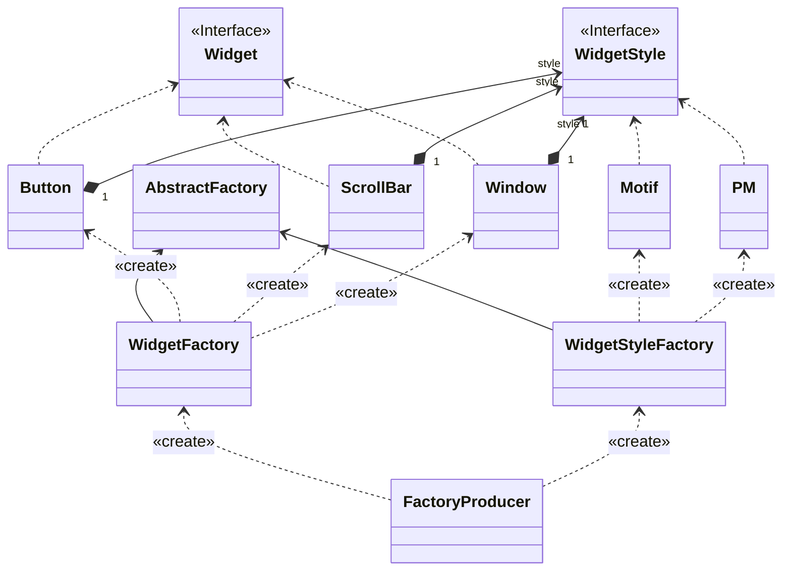
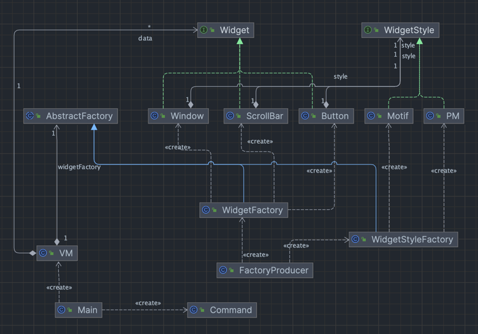

# homework GUI APP

## design

I use abstract factory pattern

```mermaid
classDiagram
direction BT
class AbstractFactory
class Button
class FactoryProducer
class Motif
class PM
class ScrollBar
class Widget {
<<Interface>>

}
class WidgetFactory
class WidgetStyle {
<<Interface>>

}
class WidgetStyleFactory
class Window

Button  ..>  Widget 
Button "1" *--> "style 1" WidgetStyle 
FactoryProducer  ..>  WidgetFactory : «create»
FactoryProducer  ..>  WidgetStyleFactory : «create»
Motif  ..>  WidgetStyle 
PM  ..>  WidgetStyle 
ScrollBar  ..>  Widget 
ScrollBar "1" *--> "style 1" WidgetStyle 
WidgetFactory  -->  AbstractFactory 
WidgetFactory  ..>  Button : «create»
WidgetFactory  ..>  ScrollBar : «create»
WidgetFactory  ..>  Window : «create»
WidgetStyleFactory  -->  AbstractFactory 
WidgetStyleFactory  ..>  Motif : «create»
WidgetStyleFactory  ..>  PM : «create»
Window  ..>  Widget 
Window "1" *--> "style 1" WidgetStyle
```

## dynamic image

