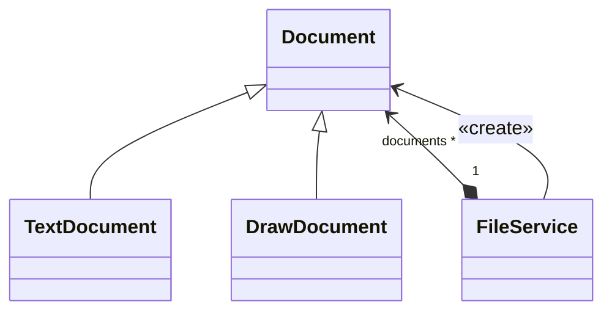
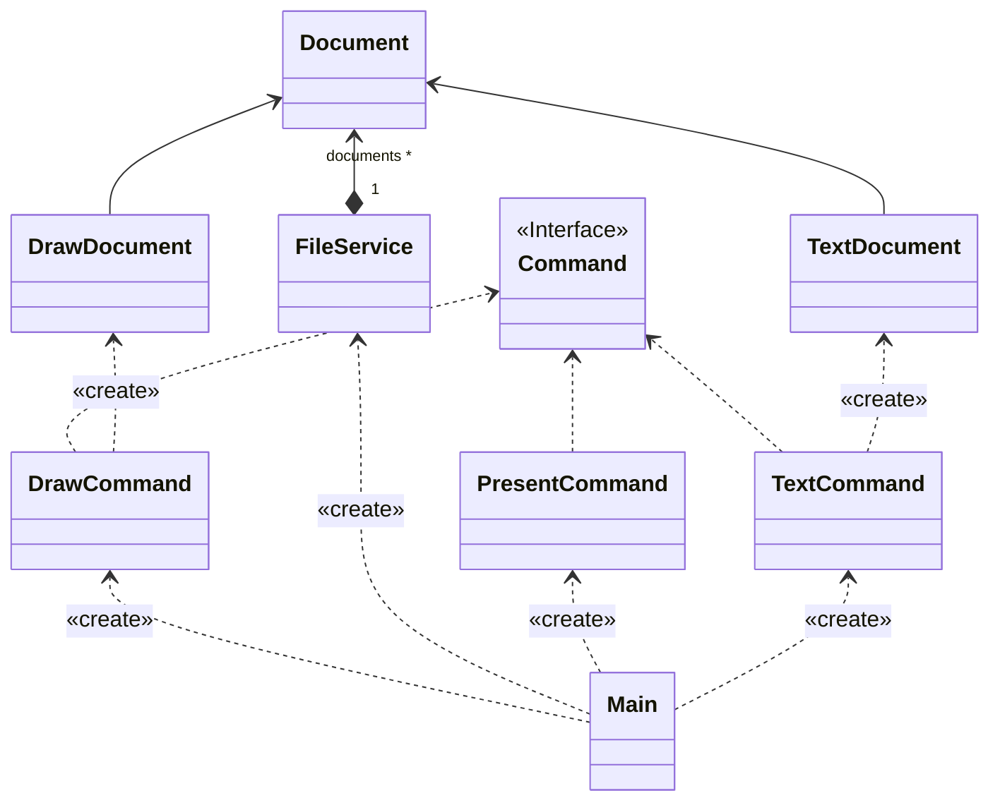

# document tool

## initial design

```mermaid
classDiagram
direction BT

class Document
class DrawDocument
class FileService
class TextDocument

TextDocument --|> Document
DrawDocument  --|>  Document 
FileService "1" *--> "documents *" Document 
FileService --> Document: «create»


```

## final design

```mermaid
classDiagram
direction BT
class Command {
<<Interface>>

}
class Document
class DrawCommand
class DrawDocument
class FileService
class Main
class PresentCommand
class TextCommand
class TextDocument

DrawCommand  ..>  Command 
DrawCommand  ..>  DrawDocument : «create»
DrawDocument  -->  Document 
FileService "1" *--> "documents *" Document 
Main  ..>  DrawCommand : «create»
Main  ..>  FileService : «create»
Main  ..>  PresentCommand : «create»
Main  ..>  TextCommand : «create»
PresentCommand  ..>  Command 
TextCommand  ..>  Command 
TextCommand  ..>  TextDocument : «create»
TextDocument  -->  Document 

```