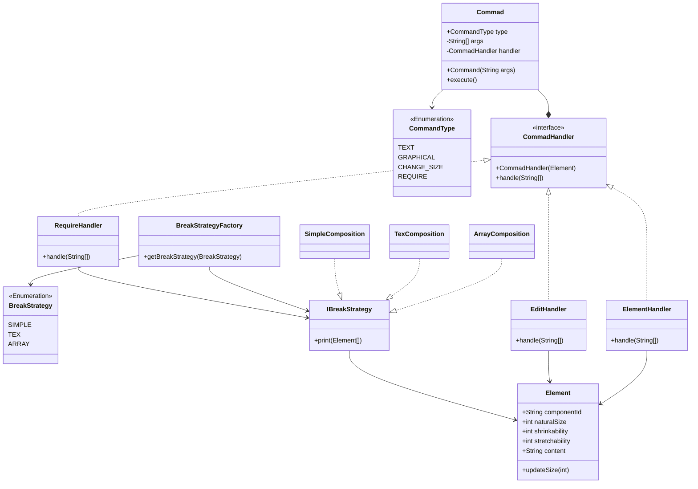
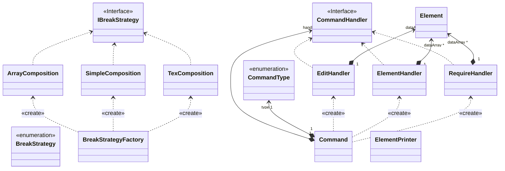

# composition pattern exercise

## class diagram

pre design

```mermaid
classDiagram
    class CommandType{
        TEXT
        GRAPHICAL
        CHANGE_SIZE
        REQUIRE
    }
    <<Enumeration>>CommandType

    class BreakStrategy{
        SIMPLE
        TEX
        ARRAY
    }
    <<Enumeration>>BreakStrategy

    class Commad{
        +CommandType type
        -String[] args
        -CommadHandler handler
        +Command(String args)
        +execute()
    }

    class CommadHandler{
        +CommadHandler(Element)
        +handle(String[])
    }
    <<interface>> CommadHandler

    Commad --* CommadHandler
    Commad --> CommandType

    class ElementHandler{
        +handle(String[])
    }

    class EditHandler{
        +handle(String[])
    }

    class RequireHandler{
        +handle(String[])
    }

    BreakStrategyFactory --> BreakStrategy
    IBreakStrategy --> Element

    CommadHandler <|.. ElementHandler
    CommadHandler <|.. EditHandler
    CommadHandler <|.. RequireHandler

    EditHandler --> Element
    ElementHandler --> Element

    class Element{
        +String componentId
        +int naturalSize
        +int shrinkability
        +int stretchability
        +String content
        +updateSize(int)
    }

    RequireHandler --> IBreakStrategy
    class IBreakStrategy{
        +print(Element[])
    }
    BreakStrategyFactory --> IBreakStrategy
    class BreakStrategyFactory{
        +getBreakStrategy(BreakStrategy)
    }

    SimpleComposition ..|> IBreakStrategy
    TexComposition ..|> IBreakStrategy
    ArrayComposition ..|> IBreakStrategy

```

post dynamic diagram

```mermaid
classDiagram
    direction BT
    class ArrayComposition
    class BreakStrategy {
        <<enumeration>>

    }
    class BreakStrategyFactory
    class Command
    class CommandHandler {
        <<Interface>>

    }
    class CommandType {
        <<enumeration>>

    }
    class EditHandler
    class Element
    class ElementHandler
    class ElementPrinter
    class IBreakStrategy {
        <<Interface>>

    }
    class RequireHandler
    class SimpleComposition
    class TexComposition

    ArrayComposition  ..>  IBreakStrategy
    BreakStrategyFactory  ..>  ArrayComposition : «create»
    BreakStrategyFactory  ..>  SimpleComposition : «create»
    BreakStrategyFactory  ..>  TexComposition : «create»
    Command "1" *--> "handler 1" CommandHandler
    Command "1" *--> "type 1" CommandType
    Command  ..>  EditHandler : «create»
    Command  ..>  ElementHandler : «create»
    Command  ..>  RequireHandler : «create»
    EditHandler  ..>  CommandHandler
    EditHandler "1" *--> "dataArray *" Element
    ElementHandler  ..>  CommandHandler
    ElementHandler "1" *--> "dataArray *" Element
    RequireHandler  ..>  CommandHandler
    RequireHandler "1" *--> "dataArray *" Element
    SimpleComposition  ..>  IBreakStrategy
    TexComposition  ..>  IBreakStrategy

```