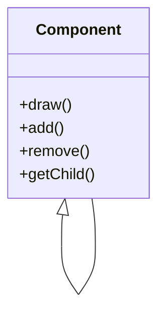
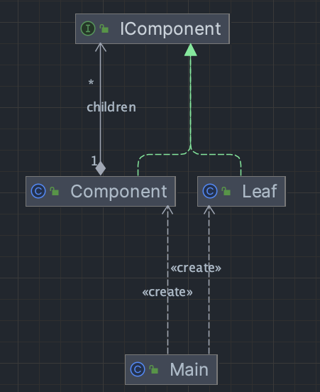

# capture application

## Spec
- In schematic capture application, there are some basic components that can be drawn such as Text, Line and Rectangle.
- The user can group basic components to form larger components, which in turn can be grouped to form still larger components.

## Design

i use the composite pattern to implement the design.

