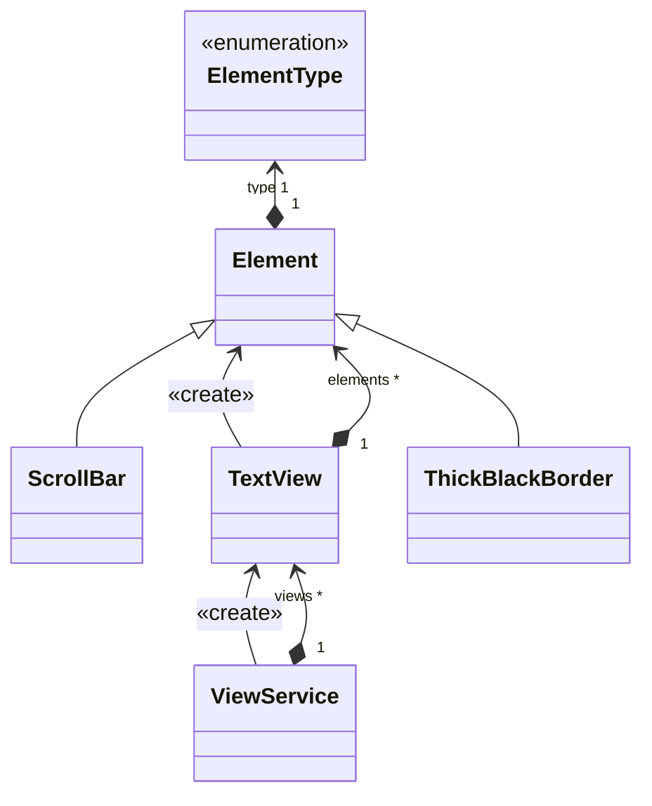
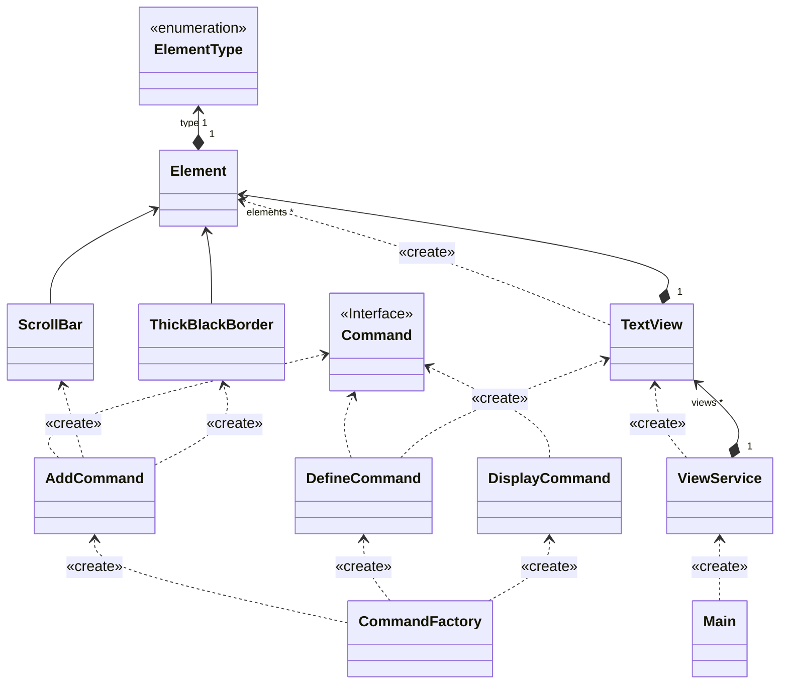

# FileViewer

## origin design

```mermaid
classDiagram
direction BT
class Element
class ElementType {
<<enumeration>>
}
class ScrollBar
class TextView
class ThickBlackBorder
class ViewService

Element "1" *--> "type 1" ElementType 
ScrollBar  --|>  Element 
TextView  -->  Element : «create»
TextView "1" *--> "elements *" Element 
ThickBlackBorder  --|>  Element 
ViewService  -->  TextView : «create»
ViewService "1" *--> "views *" TextView 

```

## final design

```mermaid
classDiagram
direction BT
class AddCommand
class Command {
<<Interface>>

}
class CommandFactory
class DefineCommand
class DisplayCommand
class Element
class ElementType {
<<enumeration>>

}
class Main
class ScrollBar
class TextView
class ThickBlackBorder
class ViewService

AddCommand  ..>  Command 
AddCommand  ..>  ScrollBar : «create»
AddCommand  ..>  ThickBlackBorder : «create»
CommandFactory  ..>  AddCommand : «create»
CommandFactory  ..>  DefineCommand : «create»
CommandFactory  ..>  DisplayCommand : «create»
DefineCommand  ..>  Command 
DefineCommand  ..>  TextView : «create»
DisplayCommand  ..>  Command 
Element "1" *--> "type 1" ElementType 
Main  ..>  ViewService : «create»
ScrollBar  -->  Element 
TextView  ..>  Element : «create»
TextView "1" *--> "elements *" Element 
ThickBlackBorder  -->  Element 
ViewService  ..>  TextView : «create»
ViewService "1" *--> "views *" TextView 

```