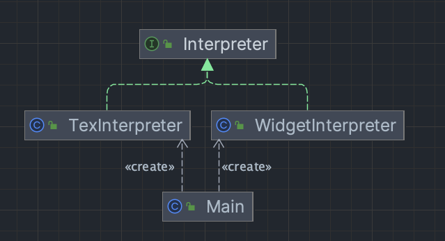
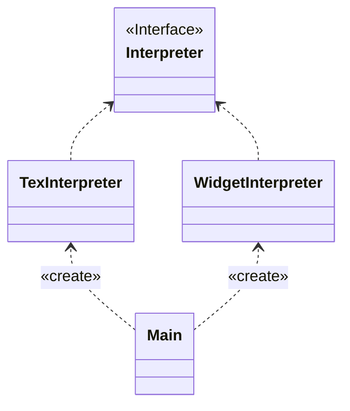

# HW rtf

## design
I use interpreter pattern to implement this homework. The interpreter pattern is a design pattern that specifies how to evaluate sentences in a language. The basic idea is to have a class for each symbol (terminal or nonterminal) in a specialized computer language. The syntax tree of a sentence in the language is an instance of the composite pattern and is used to evaluate (interpret) the sentence for a client.

## UML
