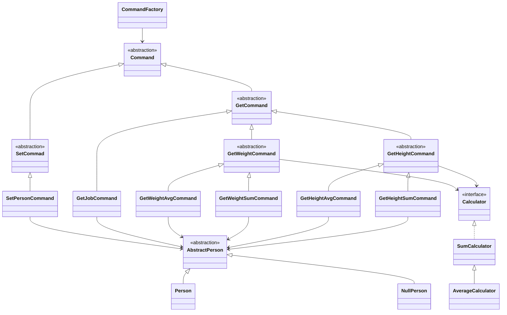
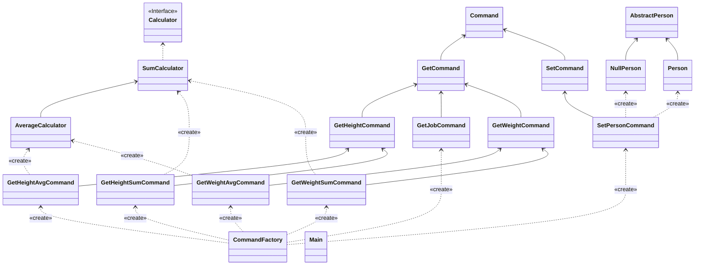

# null pattern exercise

## class diagram
design

```mermaid
classDiagram
    class Command{
    }
    <<abstraction>>Command

    class CommandFactory{
    }

    CommandFactory --> Command

    class SetCommad{
    }
    <<abstraction>>SetCommad

    class SetPersonCommand{
    }

    class GetCommand{
    }
    <<abstraction>>GetCommand

    Command <|-- SetCommad
    SetCommad <|-- SetPersonCommand
    Command <|--GetCommand

    class GetJobCommand{
    }

    GetCommand <|-- GetJobCommand

    class GetWeightCommand{
    }
    <<abstraction>>GetWeightCommand

    class GetHeightCommand{
    }
    <<abstraction>>GetHeightCommand

    class GetWeightSumCommand{
    }

    class GetHeightSumCommand{
    }

    class GetWeightAvgCommand{
    }

    class GetHeightAvgCommand{
    }

    GetCommand <|-- GetWeightCommand
    GetCommand <|-- GetHeightCommand
    GetWeightCommand <|-- GetWeightSumCommand
    GetWeightCommand <|-- GetWeightAvgCommand
    GetHeightCommand <|-- GetHeightSumCommand
    GetHeightCommand <|-- GetHeightAvgCommand

    class AbstractPerson{
    }
    <<abstraction>>AbstractPerson

    class Person{
    }

    class NullPerson{
    }

    AbstractPerson <|-- Person
    AbstractPerson <|-- NullPerson

    class Calculator{
    }
    <<interface>>Calculator

    class SumCalculator{
    }

    class AverageCalculator{
    }

    Calculator <|.. SumCalculator
    SumCalculator <|-- AverageCalculator

    SetPersonCommand --> AbstractPerson
    GetJobCommand --> AbstractPerson
    GetWeightAvgCommand --> AbstractPerson
    GetWeightSumCommand --> AbstractPerson
    GetHeightAvgCommand --> AbstractPerson
    GetHeightSumCommand --> AbstractPerson

    GetWeightCommand --> Calculator
    GetHeightCommand --> Calculator


```
final dynamic class diagram

```mermaid
classDiagram
    direction BT
    class AbstractPerson
    class AverageCalculator
    class Calculator {
        <<Interface>>

    }
    class Command
    class CommandFactory
    class GetCommand
    class GetHeightAvgCommand
    class GetHeightCommand
    class GetHeightSumCommand
    class GetJobCommand
    class GetWeightAvgCommand
    class GetWeightCommand
    class GetWeightSumCommand
    class Main
    class NullPerson
    class Person
    class SetCommand
    class SetPersonCommand
    class SumCalculator

    AverageCalculator  -->  SumCalculator
    CommandFactory  ..>  GetHeightAvgCommand : «create»
    CommandFactory  ..>  GetHeightSumCommand : «create»
    CommandFactory  ..>  GetJobCommand : «create»
    CommandFactory  ..>  GetWeightAvgCommand : «create»
    CommandFactory  ..>  GetWeightSumCommand : «create»
    CommandFactory  ..>  SetPersonCommand : «create»
    GetCommand  -->  Command
    GetHeightAvgCommand  ..>  AverageCalculator : «create»
    GetHeightAvgCommand  -->  GetHeightCommand
    GetHeightCommand  -->  GetCommand
    GetHeightSumCommand  -->  GetHeightCommand
    GetHeightSumCommand  ..>  SumCalculator : «create»
    GetJobCommand  -->  GetCommand
    GetWeightAvgCommand  ..>  AverageCalculator : «create»
    GetWeightAvgCommand  -->  GetWeightCommand
    GetWeightCommand  -->  GetCommand
    GetWeightSumCommand  -->  GetWeightCommand
    GetWeightSumCommand  ..>  SumCalculator : «create»
    NullPerson  -->  AbstractPerson
    Person  -->  AbstractPerson
    SetCommand  -->  Command
    SetPersonCommand  ..>  NullPerson : «create»
    SetPersonCommand  ..>  Person : «create»
    SetPersonCommand  -->  SetCommand
    SumCalculator  ..>  Calculator

```