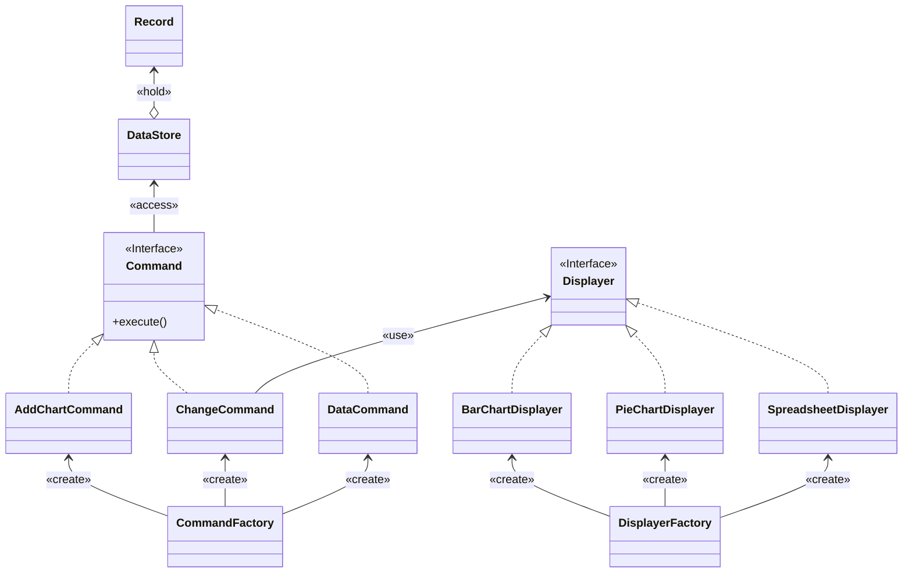
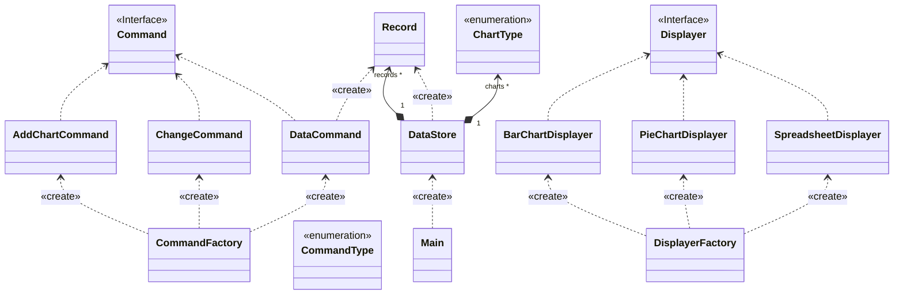

# pattern OOP exercise

## class diagram
pre design class diagram

```mermaid
classDiagram
direction BT
class AddChartCommand
class BarChartDisplayer
class ChangeCommand
class Command {
<<Interface>>
+execute()
}
class CommandFactory
class DataCommand
class DataStore
class Displayer {
<<Interface>>

}
class DisplayerFactory
class PieChartDisplayer
class SpreadsheetDisplayer

AddChartCommand  ..|>  Command 
BarChartDisplayer  ..|>  Displayer 
ChangeCommand  ..|>  Command 
CommandFactory  -->  AddChartCommand : «create»
CommandFactory  -->  ChangeCommand : «create»
CommandFactory  -->  DataCommand : «create»
DataCommand  ..|>  Command 
DataStore  o-->  Record : «hold»
DisplayerFactory  -->  BarChartDisplayer : «create»
DisplayerFactory  -->  PieChartDisplayer : «create»
DisplayerFactory  -->  SpreadsheetDisplayer : «create»
PieChartDisplayer  ..|>  Displayer 
SpreadsheetDisplayer  ..|>  Displayer 

Command --> DataStore : «access»

ChangeCommand --> Displayer : «use»
```

post dynamic class diagram

```mermaid
classDiagram
    direction BT
    class AddChartCommand
    class BarChartDisplayer
    class ChangeCommand
    class ChartType {
        <<enumeration>>

    }
    class Command {
        <<Interface>>

    }
    class CommandFactory
    class CommandType {
        <<enumeration>>

    }
    class DataCommand
    class DataStore
    class Displayer {
        <<Interface>>

    }
    class DisplayerFactory
    class Main
    class PieChartDisplayer
    class Record
    class SpreadsheetDisplayer

    AddChartCommand  ..>  Command
    BarChartDisplayer  ..>  Displayer
    ChangeCommand  ..>  Command
    CommandFactory  ..>  AddChartCommand : «create»
    CommandFactory  ..>  ChangeCommand : «create»
    CommandFactory  ..>  DataCommand : «create»
    DataCommand  ..>  Command
    DataCommand  ..>  Record : «create»
    DataStore "1" *--> "charts *" ChartType
    DataStore "1" *--> "records *" Record
    DataStore  ..>  Record : «create»
    DisplayerFactory  ..>  BarChartDisplayer : «create»
    DisplayerFactory  ..>  PieChartDisplayer : «create»
    DisplayerFactory  ..>  SpreadsheetDisplayer : «create»
    Main  ..>  DataStore : «create»
    PieChartDisplayer  ..>  Displayer
    SpreadsheetDisplayer  ..>  Displayer
```