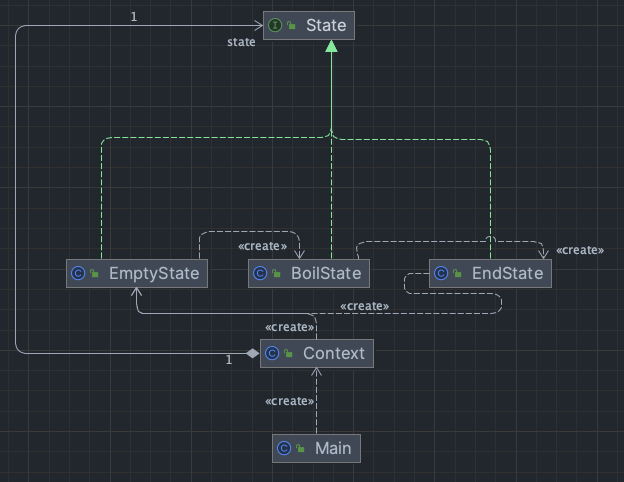
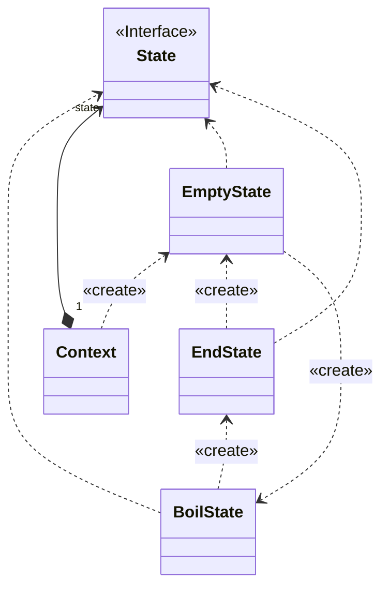

# hw boiler

## design
I use state pattern to handle state change. The state pattern is a behavioral software design pattern that implements a state machine in an object-oriented way. With the state pattern, a state machine is implemented by implementing each individual state as a derived class of the state pattern interface, and implementing state transitions by invoking methods defined by the pattern's superclass.

## uml

